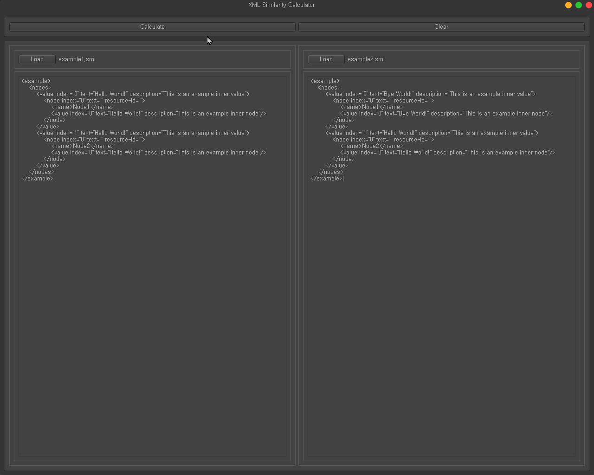
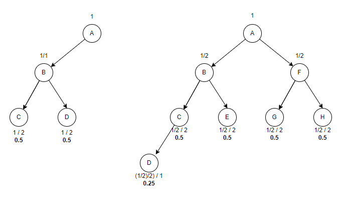

# python-similarity-calculator

* Calculate similarity between two XML or JSON files.
* If selected xml file then convert xml to dict format for check similarity score
* Make with
    * [PyQt5](https://github.com/PyQt5) GUI library
    * [qtmodern](https://github.com/gmarull/qtmodern) theme
    * [xmltodict](https://github.com/martinblech/xmltodict) library
    * [deepdiff](https://github.com/seperman/deepdiff) library

 

  

## 0. Change Log

### version 1.0.1 (2022.03.28)

* Commit history
    * [pepsi-17] FIX: complexity improvement for long and deep nodes
    * [pepsi-16] FEAT: add function to switch each target
    * [pepsi-15] FIX: different issues depending on weight allocation order
    * [pepsi-14] FEAT: add load status of each target

 

## 1. Getting Started

### 1-1. Installation

1. Download the latest version from [GitHub](https://github.com/pepsizerosugar/python-similarity-calculator/releases).
    1. Build Main.py using build.bat or just run with your interpreter setting.
    2. When build is finish, you can run the Calculator.exe in the 'dist' folder.
2. Or download the latest binary file what name "Calculator.zip"
   from [GitHub](https://github.com/pepsizerosugar/python-similarity-calculator/releases) and unzip it.
    1. Run the Calculator.exe

### 1-2. How to use

* Calculate
    * Select xml or json file with press 'Load' button at each section.
        * Or you can copy and paste xml or json text to each section and edit it.
    * And then press 'Calculate' button.
    * When finished, you can see the result dialog.
    * Clear the result dialog with press 'Clear' button.

* XML
    * If you select xml file, you can see the converted dict format file in the 'Resources/json' folder.

### 2-1. How is it work

* Algorithm
    * Each node have a weight.
    * Weight is calculated by the following formula.
        * If the node is the root node, the weight is 1.
        * score = parents_node_weight / same_depth_node_count
        * 
* Score
    * Simply the score of each node is the sum of the scores of the child nodes, and weight is the score.
    * Array (List)
        * When comparing arrays (lists) with the same name, each array item is cross-compared, and the score has the
          lowest score.
        * Afterwards, the difference in the length of the array is added to the score.
    * Object (Dict)
        * Only the intersection keys of the object (Dict) are compared, and the keys not included in the intersection
          are also added to the score.
    * Object(Dict) vs Array(List)
        * It is not simply that the types are different and do not compare.
        * Iterates through the list and compares the items in the list with the dict.
        * If all depths are reached and the comparisons are dict and list , then proceed.
          * Find the intersection key of a dict and the dict to be compared.
          * If there is an intersection key, the corresponding intersection key is cycled and compared.
          * In this case, the short dict will have a lower score, so in this case, the weight of each item is set to the weight of the long dict.
          * Also, long dict cycle is shorter than a short dict, so added to score that by the weight of the keys that do not intersect.
            * formula: non_intersection_weight = (long_dict_length - intersection_key_length) * weight
    * Here, 'add to the score' means 'add' because the score is subtracted from the percentile at the end.
